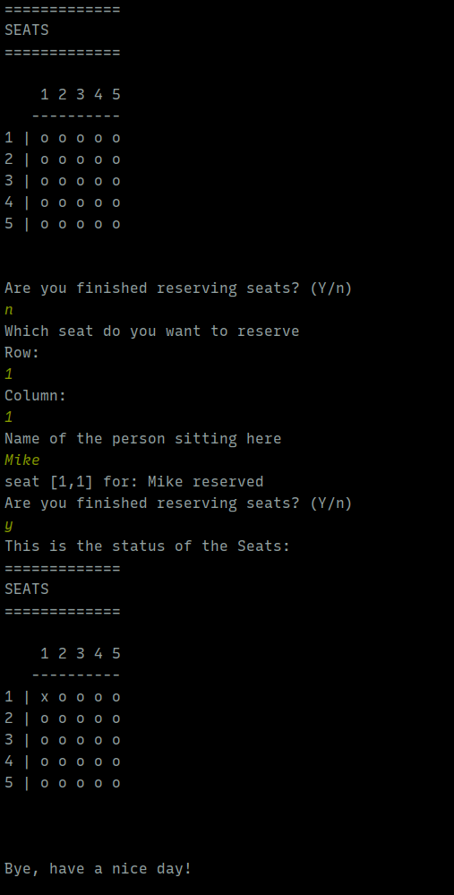
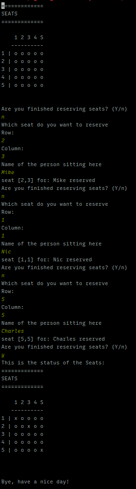
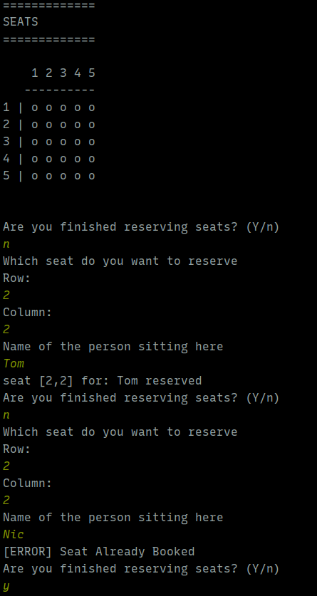

# Seat Reservation Mini Project
- [x] Small theater with 25 seats (5x5 grid)
- [x] Print the seats in the theater, and have some indication of whether they are reserved
- [x] Cannot double book.
- [x] Give a name for the reservation.
- [x] Validate the inputs and handle exceptions.

## This is a preview of a successful workflow

## This is booking multiple seats

## This is handling a seat that is already booked

